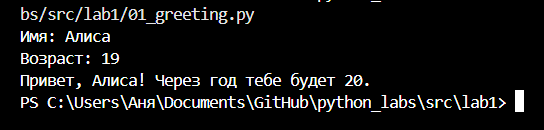
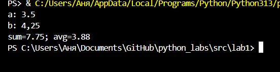
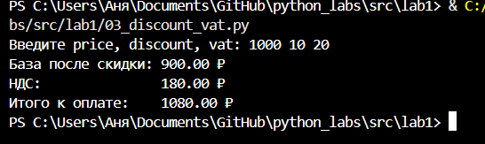
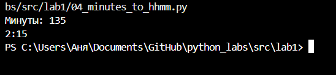
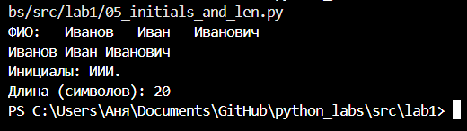

# GooDy-PiraTe (Саргаева Анна БИВТ-25-1)

## Лабораторная работа 1

### Задание 1
```python
name = input("Имя: ")
age = int(input("Возраст: "))
print(f'Привет, {name}! Через год тебе будет {age+1}.')
```


### Задание 2
```python
a = float( input("a: ").replace(',', '.') )
b = float( input("b: ").replace(',', '.') )
print(f"sum={(a+b):.2f}; avg={((a+b)/2):.2f}")
```


### Задание 3
```python
price, discount, vat = map(float, input("Введите price, discount, vat: ").split())
base = price * (1 - discount/100)
vat_amount = base * (vat/100)
total = base + vat_amount
print(f'База после скидки: {base:.2f} ₽')
print(f"НДС:               {vat_amount:.2f} ₽")
print(f'Итого к оплате:    {total:.2f} ₽')
```


### Задание 4
```python
minutes = int(input('Минуты: '))
h = minutes//60
print(f"{(minutes//60)%24}:{(minutes%60):02d}")
```


### Задание 5
```python
st = input('ФИО: ')
ln, n, nof = st.split()
print(ln, n, nof)
print(f"Инициалы: {ln[0]+n[0]+nof[0]}.") 
print(f'Длина (символов): {len(ln) + len(n) + len(nof) + 2}')
```


