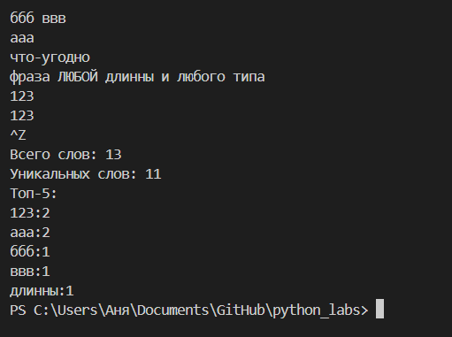

# GooDy-PiraTe (Саргаева Анна БИВТ-25-1)

## Лабораторная работа 3

### Задание B
src/text_stats.py (скрипт со stdin)
```python
import sys
import os
sys.path.append(os.path.join(os.path.dirname(__file__), '..', 'lib'))
from text import *
line = sys.stdin.read()
list_line = tokenize(normalize(line, casefold=True, yo2e=True))
print(f"Всего слов: {len(list_line)}")
c_f = count_freq(list_line)
print(f"Уникальных слов: {len(c_f)}")
top5 = top_n(c_f)
print('Топ-5:')
for elem in top5:
    print(f'{elem[0]}:{elem[1]}')

```

