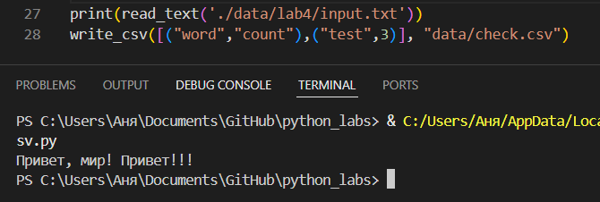
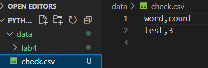
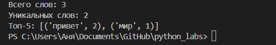
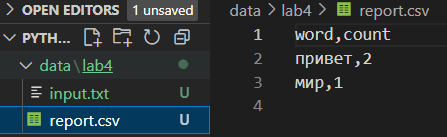
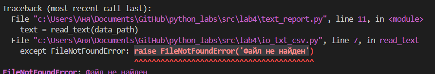

# GooDy-PiraTe (Саргаева Анна БИВТ-25-1)

## Лабораторная работа 4

### Задание A
read_text
```python
def read_text(path: str | Path, encoding: str = "utf-8") -> str:
    p = Path(path)
    try: text = p.read_text(encoding=encoding)
    except FileNotFoundError: raise FileNotFoundError('Файл не найден')  
    except UnicodeDecodeError: raise UnicodeDecodeError('unicode=[другая кодировка]') 
    return ' '.join(text.split())
```
Функция write_csv
```python
def write_csv(rows: list[tuple | list], path: str | Path, header: tuple[str, ...] | None = None) -> None:
    p = Path(path)
    rows = list(rows)
    if len(rows): eq = len(rows[0])
    with p.open("w", newline="", encoding="utf-8") as f:
        w = csv.writer(f)
        if header is not None:
            w.writerow(header)
        for r in rows:
            if len(r) != eq: raise ValueError('строки разного размера')
            w.writerow(r)
```




### Задание B

```python
import sys
import os
from pathlib import Path
sys.path.append(os.path.join(os.path.dirname(__file__), '..', 'lib'))
from text import *
from io_txt_csv import *

data_path = './data/lab4/input.txt'
report_path = './data/lab4/report.csv'

text = read_text(data_path)
norm = normalize(text)
tok = tokenize(norm)
cnt_frq = count_freq(tok)
top_5 = top_n(cnt_frq)
top_all = top_n(cnt_frq, len(cnt_frq))
write_csv(rows=top_all, path=report_path, header=['word', 'count'])

#краткий отчет
print(f"Всего слов: {len(tok)}")
print(f"Уникальных слов: {len(cnt_frq)}")
print(f'Топ-5: {top_5}')
```




