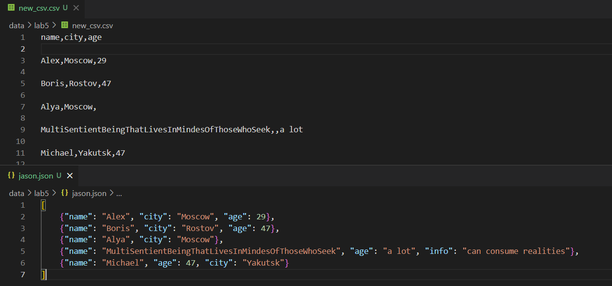
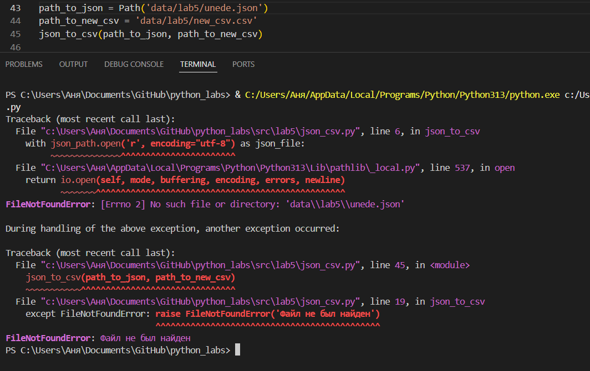
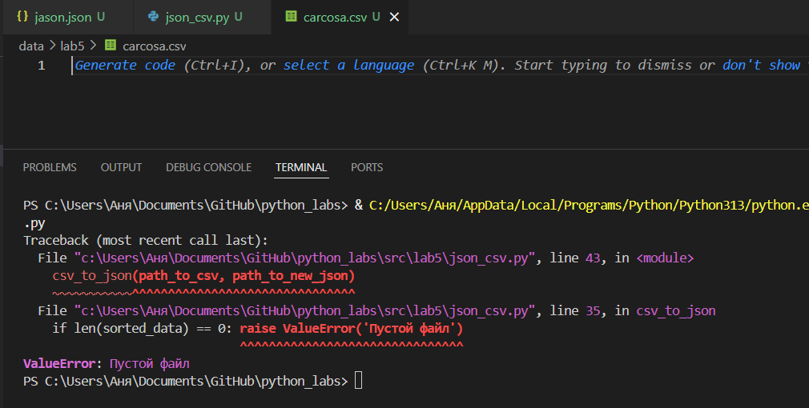
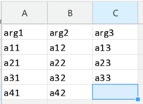
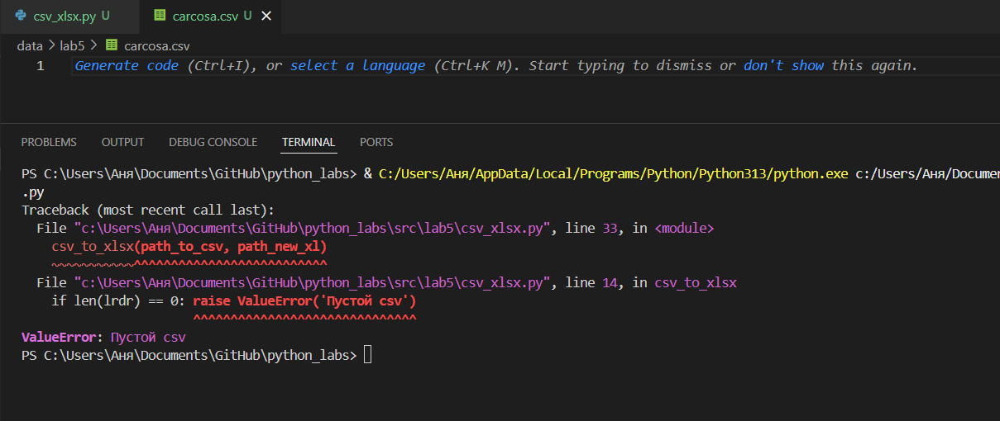
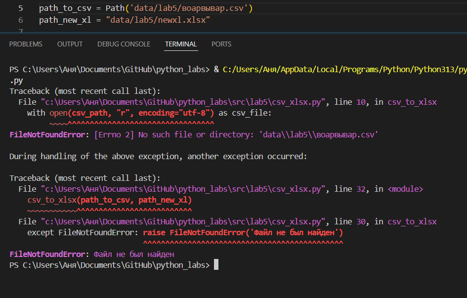

# GooDy-PiraTe (Саргаева Анна БИВТ-25-1)

## Лабораторная работа 5

### Задание A
json_to_csv
```python
def json_to_csv(json_path: str, csv_path: str) -> None:
    try:
        with json_path.open('r', encoding="utf-8") as json_file:
            data = json.load(json_file)
        if len(data) == 0: raise ValueError('Пустой JSON')
        try: head = list(data[0].keys())
        except AttributeError: raise ValueError('Внутри находятся не словари') 
        sorted_data = []
        for item in data:
            if not isinstance(item, dict): raise ValueError('Внутри находятся не словари')
            sorted_item = {key: item.get(key, None) for key in head}
            sorted_data.append(sorted_item)
        with open(csv_path, 'w', encoding='utf-8') as file:
            wrt = csv.DictWriter(file, fieldnames=head)
            wrt.writeheader()
            wrt.writerows(sorted_data)
    except FileNotFoundError: raise FileNotFoundError('Файл не был найден')
    except json.decoder.JSONDecodeError: raise ValueError("Неверный формат")
```





Функция csv_to_json
```python
def csv_to_json(csv_path: str, json_path: str) -> None:
    try:
        with open(csv_path, "r", encoding="utf-8") as csv_file:
            rdr = csv.DictReader(csv_file)
            head = rdr.fieldnames
            lrdr = list(rdr)
            sorted_data = []
            for elem in lrdr:
                sorted_elem = {key: elem.get(key) for key in head}
                sorted_data.append(sorted_elem)
        sorted_data = []
        if len(sorted_data) == 0: raise ValueError('Пустой файл')
        with open(json_path, "w", encoding="utf-8") as json_file:
            json.dump(sorted_data, json_file, indent=4, ensure_ascii=True, sort_keys=True)
    except FileNotFoundError: raise FileNotFoundError('Файл не был найден')
        
```




### Задание B
csv_to_xlsx
```python
def csv_to_xlsx(csv_path: str, xlsx_path: str) -> None:
    try:
        with open(csv_path, "r", encoding="utf-8") as csv_file:
            rdr = csv.DictReader(csv_file)
            head = rdr.fieldnames
            lrdr = list(rdr)
            if len(lrdr) == 0: raise ValueError('Пустой csv')
            sorted_data = []
            for elem in lrdr:
                sorted_elem = {key: elem.get(key) for key in head}
                sorted_data.append(sorted_elem)
        wb = Workbook()
        ws = wb.active
        ws.title = "Sheet1"
        ws.append(head)
        for elem in sorted_data:
            row = [elem.get(key, '') for key in head]
            ws.append(row)
        for col in ws.columns:
            mxl = max( len(str(cell.value or '')) for cell in col )
            ws.column_dimensions[col[0].column_letter].width = max(mxl+2, 8)
        wb.save(xlsx_path)
    except FileNotFoundError: raise FileNotFoundError('Файл не был найден')
```



