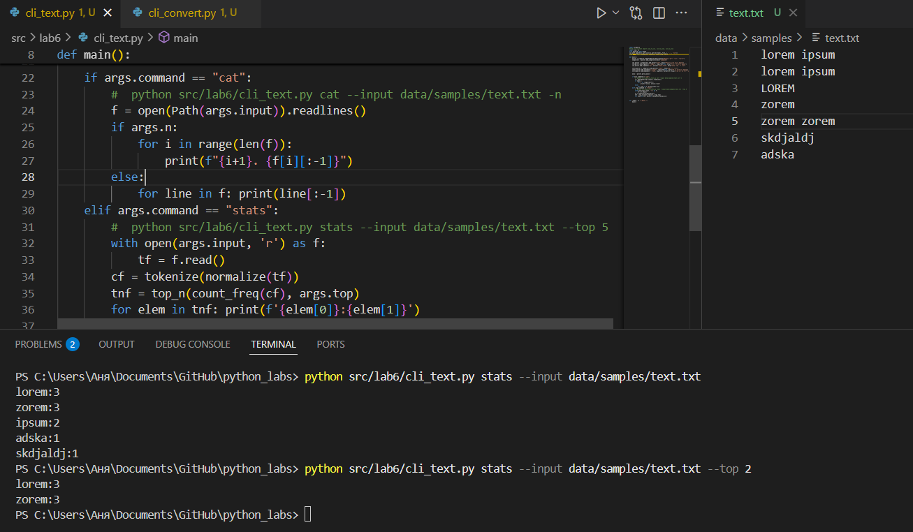
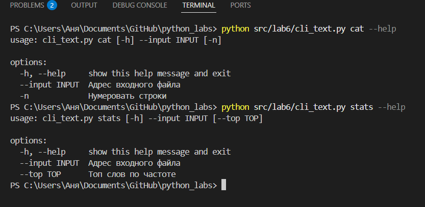
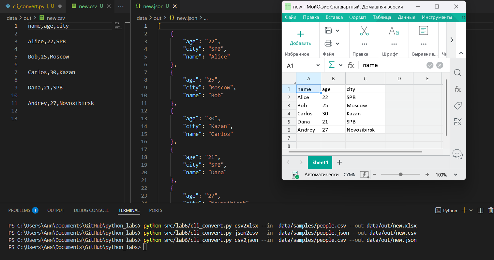

# GooDy-PiraTe (Саргаева Анна БИВТ-25-1)

## Лабораторная работа 6

### Задание A
cli_text.py
```python
def main():
    parser = argparse.ArgumentParser(description="Анализ частот слов в тексте")
    subparsers = parser.add_subparsers(dest="command")

    cat_parser = subparsers.add_parser("cat", help="Вывести содержимое файла")
    cat_parser.add_argument("--input", required=True, help="Адрес входного файла")
    cat_parser.add_argument("-n", action="store_true", help="Нумеровать строки")

    stats_parser = subparsers.add_parser("stats", help="Частоты слов")
    stats_parser.add_argument("--input", required=True, help="Адрес входного файла")
    stats_parser.add_argument("--top", type=int, default=5, help='Топ слов по частоте')

    args = parser.parse_args()

    if args.command == "cat":
        #  python src/lab6/cli_text.py cat --input data/samples/text.txt -n
        f = open(Path(args.input)).readlines()
        if args.n:
            for i in range(len(f)):
                print(f"{i+1}. {f[i][:-1]}")
        else:
            for line in f: print(line[:-1])
    elif args.command == "stats":
        #  python src/lab6/cli_text.py stats --input data/samples/text.txt --top 5
        with open(args.input, 'r') as f:
            tf = f.read()
        cf = tokenize(normalize(tf))
        tnf = top_n(count_freq(cf), args.top)
        for elem in tnf: print(f'{elem[0]}:{elem[1]}') 

```





### Задание B
cli_convert.py
```python
def main():
    try: 
        parser = argparse.ArgumentParser(description="Конвертеры данных")
        sub = parser.add_subparsers(dest="cmd")

        jc = sub.add_parser("json2csv", help='Конвертирует json в csv')
        jc.add_argument("--in", dest="input", required=True, help="Адрес входного файла")
        jc.add_argument("--out", dest="output", required=True, help="Адрес для итогового файла")

        cj = sub.add_parser("csv2json", help='Конвертирует csv в json')
        cj.add_argument("--in", dest="input", required=True, help="Адрес входного файла")
        cj.add_argument("--out", dest="output", required=True, help="Адрес для итогового файла")

        cx = sub.add_parser("csv2xlsx", help='Конвертирует csv в xlsx')
        cx.add_argument("--in", dest="input", required=True, help="Адрес входного файла")
        cx.add_argument("--out", dest="output", required=True, help="Адрес для итогового файла")

        args = parser.parse_args()
        a = args.cmd
        match a:
            case "json2csv":
                if not args.input.exists(): raise FileNotFoundError(f"Файл не найден")
                json_to_csv(args.input, args.output)
            case "csv2json": 
                if not args.input.exists(): raise FileNotFoundError(f"Файл не найден")
                try: csv_to_json(args.input, args.output)
                except: pass
            case "csv2xlsx": 
                if not args.input.exists(): raise FileNotFoundError(f"Файл не найден")
                try: csv_to_xlsx(args.input, args.output)
                except: pass
    except: parser.error('Некорректные аргументы')

```


