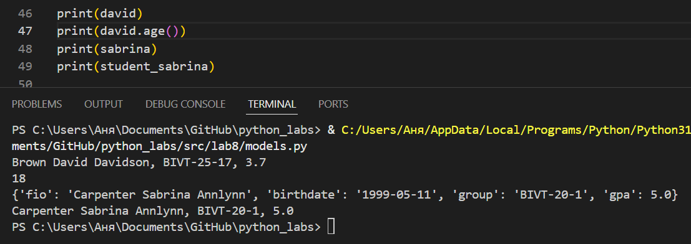
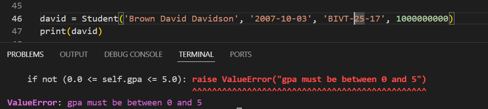

# GooDy-PiraTe (Саргаева Анна БИВТ-25-1)

## Лабораторная работа 8

### Задание A
models.py
```python
from dataclasses import dataclass
from datetime import *


@dataclass
class Student:
    fio: str
    birthdate: str
    group: str
    gpa: float

    def __post_init__(self):
        try:
            datetime.strptime(self.birthdate, "%Y-%m-%d")
        except ValueError:
            raise ValueError("warning: birthdate format might be invalid")
        if not (0.0 <= self.gpa <= 5.0):
            raise ValueError("gpa must be between 0 and 5")

    def __str__(self):
        return f"{self.fio}, {self.group}, {self.gpa}"

    def age(self) -> int:
        today = date.today()
        bd_year = int(self.birthdate.split("-")[0])
        return today.year - bd_year

    def to_dict(self) -> dict:
        return {
            "fio": self.fio,
            "birthdate": self.birthdate,
            "group": self.group,
            "gpa": self.gpa,
        }

    @classmethod
    def from_dict(cls, d: dict):
        return cls(
            fio=d["fio"], birthdate=d["birthdate"], group=d["group"], gpa=d["gpa"]
        )
```

предусмотренные ошибки из-за формата даты рождения и неликвидного среднего балла


### Задание B
serialize.py
```python
import json
from models import Student
from pathlib import Path


def students_to_json(students: list, path: str) -> None:
    data = [s.to_dict() for s in students]
    with open(path, "w", encoding="utf-8") as f:
        json.dump(data, f, ensure_ascii=True, indent=2)


def students_from_json(path: str) -> list["Student"]:
    try:
        with (Path(path)).open("r", encoding="utf-8") as f:
            dict_data = json.load(f)
        if len(dict_data) == 0:
            raise ValueError("Пустой JSON")
        data = []
        for student in dict_data:
            data.append(Student.from_dict(student))
        return data
    except FileNotFoundError:
        raise FileNotFoundError("Файл не был найден")


path_to_json = Path("data/lab8/students_input.json")
npath = "data/lab8/students_output.json"

```


