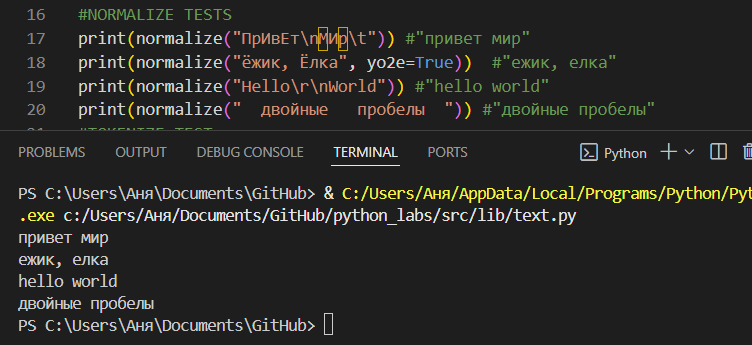
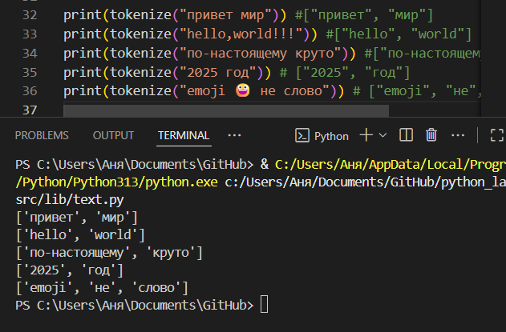
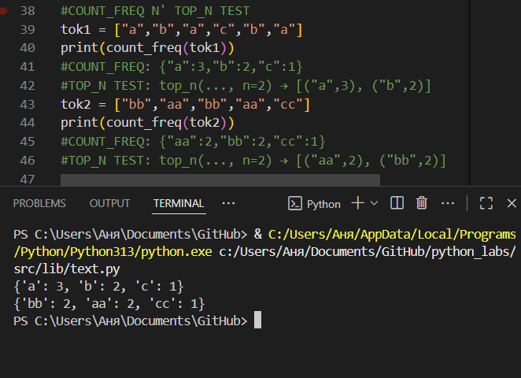
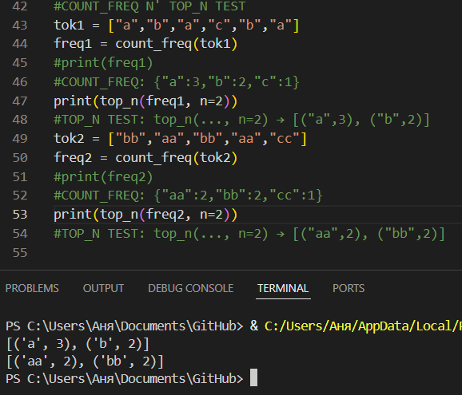

# GooDy-PiraTe (Саргаева Анна БИВТ-25-1)

## Лабораторная работа 3

### Задание A
normalize
```python
def normalize(text: str, *, casefold: bool = True, yo2e: bool = True) -> str:
    if casefold: text = text.casefold()
    if yo2e: text = (text.replace('ё', 'е')).replace('Ё', 'Е')
    text = ' '.join(text.split())
    return text
```


tokenize
```python
def tokenize(text: str) -> list[str]:
    tokens = findall(r'\w+(?:-\w+)*', text)
    return tokens
```


count_freq
```python
def count_freq(tokens: list[str]) -> dict[str, int]:
    freq = {}
    for token in tokens:
        freq[token] = freq.get(token, 0) + 1
    return freq
```


top_n
```python
def top_n(freq: dict[str, int], n: int = 5) -> list[tuple[str, int]]:
    freq_sorted = sorted(freq.items(), key=lambda item: (-item[1], item[0]))
    ans = []
    for i in range(n):
        try: ans.append(freq_sorted[i])
        except: break 
    return ans
```


